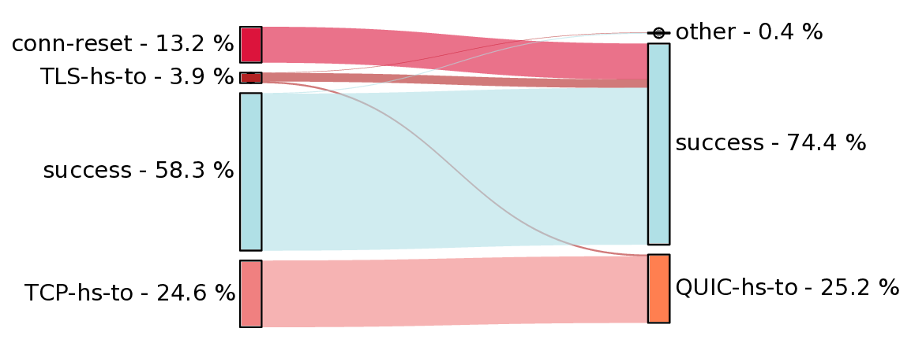
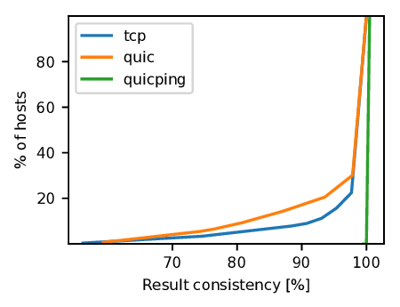

# Workflow: HTTP/3 censorship measurements with URLGETTER

## [Input generation](preprocessing)

### 0. Run all steps.
- ```input_generator.py [-h] -cc COUNTRYCODE -t TARGETDIR [-g] [-v]```
- use ```-g``` to use both local country list as well as global list (which must be generated first)
- result: ```targetdir/<COUNTRYCODE>[_global]_http3_filtered_cacheddns.txt``` with lines like this: ```url-----ip```

### 1. Extract urls
**Extracts url strings from csv tables in [citizenlab test-lists](https://github.com/citizenlab/test-lists)**
- run: ```generate_txt_input.py [-h] -cc COUNTRYCODE -t TARGETDIR```
- result: ```targetdir/<COUNTRYCODE>.txt```

### 2. Check HTTP/3 compatibility
**Filter urls for HTTP/3 support.**
- download latest probe-cli release
- run: ```check_http3.py [-h] -i INPUTFILE -t TARGETDIR [-v]```
- result: ```targetdir/<COUNTRYCODE>_http3.txt```

### 3. Aggregate (optional)
**Combine global and countryspecific lists.**
- run: ```aggregate.py [-h] FILE1 FILE2 [FILE3 ...]```
- result: ```targetdir/<COUNTRYCODE1]_http3_<COUNTRYCODE2>_http3.txt```

### 4. Filter risky categories
**Filter out domains from certain content categories.**
- as ```-c``` parameter I use: "XED GAYL PORN PROV DATE MINF REL LGBT"
- run: ```filter_categories.py [-h] -i INPUTURL_FILE_PATH -cc COUNTRYCODE -t TARGETDIR -c CATEGORIES [-g]```
- result: ```targetdir/<COUNTRYCODE>_http3.txt.filtered.txt```

### 5. Resolve IP addresses
**Resolve domain names by querying dot://8.8.8.8 (Google DNS)**
- run ```resolve.py [-h] -i INPUTFILE -p PREFIX -t TARGETDIR``` 
- result: ```targetdir/[PREFIX]_cacheddns.txt``` with lines like this: ```url-----ip```

<br>
<br>

## [Run the measurement](runscript.py)

### 1. Download latest probe-cli release
- https://github.com/ooni/probe-cli/releases
- ```probe-cli/internal$ go build ./cmd/miniooni```
- Initialize ```miniooni``` by consenting to the risks of running OONI, e.g. with this command: <br/>
```./miniooni --yes -i https://ooni.org urlgetter```

### 2. Runner script
- ```runscript.py [-h] -u URLS -p MINIOONI_PATH```, where URLS is the generated input file and MINIOONI_PATH leads to the location of the miniooni executable (```internal/miniooni```)

- on remote machine: 
  ```torsocks ssh HOST```
  ```nohup python3 runscript.py -u URLS.txt -p ./miniooni &```

<br>
<br>

## [Examine and visualize the results](evaluation)
**Sanity checks** <br/>
For both evaluation scripts, you can add a postprocessing sanity check. The base of the sanity check is a json(l) file which contains a measurement taken in a trusted (i.e. uncensored) network using the same input as the analyzed meausurement(s). The idea is that, if servers have malfunctions or their QUIC support is unstable, it shows up as a failure in an uncensored network and should be filtered out from the measurements. Momentary malfunctions are not filtered out with this mechanism.

### Filter measurements
**Print URL, step and failure type of filtered measurements** <br/>
Measurements can be searched and filtered with a variety of filters:
- experiment step: urlgetter_step as specified in ```["annotations"]["urlgetter_step"]``` for urlgetter measurements, or "quicping" for quicping measurements
- URL
- IP address
- transport protocol
- ASN
- failure types
- server type 
Check out usage below for examples.

**Usage***
- ```filter.py [-h] -F FILE [-s STEPS] [-u INPUTURL] [-ip IP] [-p PROTO] [-a ASN] [-t FAILURETYPE] [-m SERVER] [-f] [-S] [-d] [-l] [-c SANITYCHECK][-T RUNTIME]```
- use ```-F``` parameter to define the file(s) to be evaluated; this can be a file or a folder
- use filter ```-s``` to only examine certain measurement steps, e.g. "tcp_cached"
- use filter ```-u``` to investigate measurements of a specific URL
- use filter ```-ip``` to investigate measurements of a specific IP address
- use filter ```-p``` to investigate measurements of a specific protocol, e.g. "quic", "tcp"
- use filter ```-a``` to investigate measurements of a specific ASN, e.g. "AS6805"
- use filter ```-t``` to investigate measurements with specific failure types, e.g. "TLS-hs-to TCP-hs-to"
- use filter ```-m``` to investigate measurements of a specific server type, e.g. "nginx", "cloudflare"
- use the flag ```-f``` to only examine failed measurements
- use the flag ```-S``` to only examine successful measurements
- use ```-d``` to print cummulative result as a dictionary at the end
- use ```-l``` to print cummulative result as a list at the end
- use ```-c``` to specify a file for a sanity check (see above, Sanity check)


### Visualize data correlation
**Generate a sankey diagram that depicts the correlation between different urlgetter measurement steps**
- ```eval.py MODE [-h] -F FILE [-s STEPS] [-a ASN] [-e] [-c SANITYCHECK] [-S]```
- ```MODE``` is the evaluation mode to use, currently it can be one of "sankey", "consistency", "throttling" (see below)
- the file(s) to be evaluated are defined by the ```-F``` parameter; this can be a file or a folder
- use ```-s``` to define the measurement steps that are compared, e.g. "tcp_cached quic_cached" (for urlgetter step=data["annotations"]["urlgetter_step"], quicping measurements are always step="quicping"), separated by ","
- use ```-a``` to define the target ASNs, separated by ","
- use the flag ```-e``` to only investigate measurements that failed in the first of the two steps 
- use ```-c``` to specify a file for a sanity check (see above, Sanity check)
- use ```-S``` to save the generated plot

#### **Example usage: Sankey**
Generate a **sankey flow** diagram to compare the results of **HTTPS and HTTP/3** urlgetter measurements (annotated with ```urlgetter_step=tcp_cached/quic_cached```) in **AS45090** for all measurement files in the **folder** ```./folder```, and **store** the resulting diagram. Use the **sanity check** file (same measurements taken from a trusted network) stored in ```./sanity_check.jsonl```
```
python3 eval.py sankey -F ./folder -s "tcp_cached,quic_cached" -a AS45090 -c ./sanity_check.jsonl -S
```
Result: 



#### **Example usage: Consistency**
- Generate a **CDF function** of the consistency of urlgetter HTTPS and HTTP/3 as well as quicping measurements in **AS45090** for all measurement files in the folder ```./folder``` and store the resulting diagram.
```
python3 eval.py consistency -F ./folder -s "tcp_cached,quic_cached,quicping" -a AS45090 -S
```
Result:
