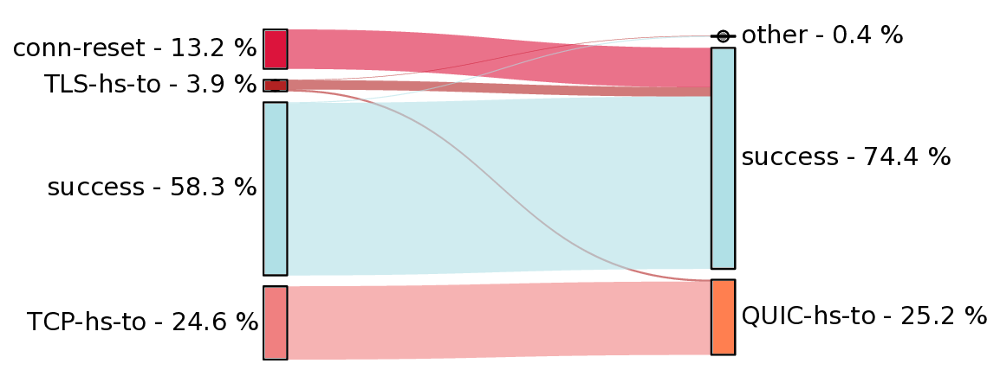
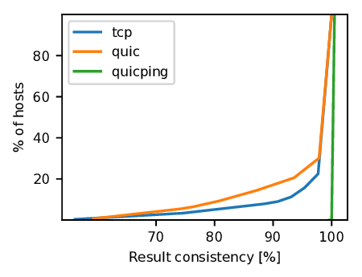

# Evaluation methods for HTTP/3 measurements

## Simple evaluation
This is the easy to use method for analyzing HTTP/3 measurements (taken with OONI's urlgetter experiment). <br/>
You only have to specify the **range of dates** and the **ASN** you are interested in and the script searches for OONI HTTP/3 measurements online. The relevant files are downloaded from OONI servers, briefly evaluated in the command line and visualized.

If you interested in a specific **country**, run ```http3.py -a COUNTRYCODE```, e.g. ```http3.py -a DE``` to get a list of the ASN's with HTTP/3 measurements in this country.


### Usage:
```http3.py [-h] [-f FILE] -a ASN [-d DATES] [-o OUT]```
- use ```-a``` to specify the ASN you want to investigate, e.g. "AS45090". If you interested in a specific country, run ```http3.py -a COUNTRYCODE```, e.g. ```http3.py -a DE``` to get a list of the ASN's with HTTP/3 measurements in this country.
- use ```-d``` to specify the dates range to investigate, e.g. "2022-02-01 2022-03-01"
- use ```-f``` to evaluate a local file (or folder) with HTTP/3 urlgetter measurements. With this option there will be no lookup of measurements online and the ```-a``` and ```-d``` options will be ignored.
- use ```-o``` to specify the name of the resulting output pdf file.

<br/>
<br/>


## Detailed evaluation methods

**Sanity checks** <br/>
For the detailed evaluation, you can add a postprocessing sanity check. The base of the sanity check is a json(l) file which contains a measurement taken in a trusted (i.e. uncensored) network using the same input as the analyzed meausurement(s). The idea is that, if servers have malfunctions or their QUIC support is unstable, it shows up as a failure in an uncensored network and should be filtered out from the measurements. Momentary malfunctions are not filtered out with this mechanism.


### Visualize data correlation
**Generate a sankey diagram that depicts the correlation between different urlgetter measurement steps**
- ```eval.py MODE [-h] -f FILE [-c SANITYCHECK] [-o OUT] [-v] [-S SANKEY] [-C FILTERS]```
- ```MODE``` is the evaluation mode to use, currently it can be one of "sankey", "consistency", "throttling", "runtimes", "print-details", "print-urls" (see below)
- the file(s) to be evaluated are defined by the ```-f``` parameter; this can be a file or a folder
- use ```-c``` to specify a file for a sanity check (see above, Sanity check)
- use ```-o``` to define an output file name to save the result
- use ```-v``` to show verbose output
- use ```-S``` to specify the name of a .json file with the filters for the two compared classes of measurements, only works with MODE "sankey",  see [examples/sankey_classes.json](examples/sankey_classes.json). [examples/filter_classes.json](examples/filter_classes.json) contains the full list of supported filters.
- use ```-C``` to specify the name of a .json file with the filters for the (multiple) compared classes of measurements, only works with MODEs "consistency", "throttling" and "runtimes", see [./examples/filter_classes.json](examples/filter_classes.json) for a full list of supported filters.

### **Example usage: Sankey**
Generate a **sankey flow** diagram to compare the results of **HTTPS and HTTP/3** urlgetter measurements (annotated with ```urlgetter_step=tcp_cached/quic_cached```) in **AS45090** for all measurement files in the **folder** ```./folder```, and **store** the resulting diagram in ```example.pdf```. Use the **sanity check** file (same measurements taken from a trusted network) stored in ```./sanity_check.jsonl```
```
python3 eval.py sankey -f ./folder -S ../examples/sankey_classes.json -c ./sanity_check.jsonl -o example.pdf
```
Result: 



### **Example usage: Consistency**
- Generate a **CDF function** of the consistency of urlgetter HTTPS and HTTP/3 as well as quicping measurements in **AS45090** for all measurement files in the folder ```./folder``` and store the resulting diagram in example.pdf.
```
python3 eval.py consistency -f ./folder -C ../examples/filter_classes.json -o example.pdf
```
Result:
